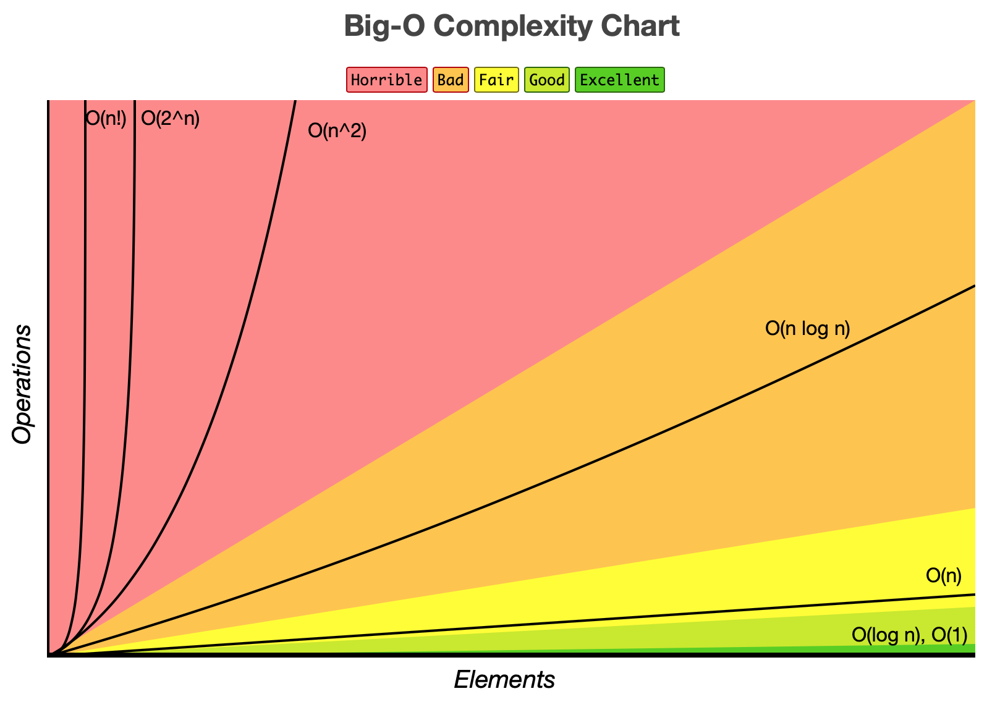

---


<p align="center"> <a href="https://youtu.be/HtFHehe1XdQ"> Recorded videos (Thanks Willy!) </a> </p>

---

# Complexity

It is important to know how fast or slow our algorithm performs, and how that can change based on the input size. The time is defined by the implementation details and input size. We can define the complexity of an algorithm by the number of steps it will take to run.

---

# Big O Notation

Big O is used to measure the program efficiency based on the time it takes to run it with an input of size N. We want to represent what is the **worst-case** scenario in terms of time complexity.

## Constant Time: O(1)

Consider to be of constant time any algorithm that will require the same amount of time regardless of its input size.

**Examples:** Push and pop functions for fixed-sized stacks, enqueue and dequeue functions for fixed-size queue.

## Linear Time: O(N)

Consider to be of linear time any algorithm that its running time is directly proportional to the size of the input. In other words, the time taken to run the algorithm increases constantly as the number of input elements increases.

**Examples:** Finding the minimum element in an array.

## Logarithmic Time: O(logN)

Consider to be of logarithmic time any algorithm that its execution time is proportional to the log of the input size. In other words, it doesn't use the whole input, it only looks at a portion of it.

**Examples:** Binary search

## Quadratic Time: O(N^2)

Consider to be of quadratic time any algorithm that its execution time is proportional to the square of the input size.

**Examples:** Selection and insertion sort

 

*Source:* <a href="https://www.bigocheatsheet.com"> Big O Cheatsheet </a>

---

## Example: Find Large

Consider this first function findlarge1 that allocates the first element of the array to a variable and compares with the other elements of the array, changing the contents of the variable as larger elements are discovered.

```c
int findlarge1(int array[], int arr_len){
  int large = array[0];

  for (int i=0; i < arr_len; i++){
    if (array[i] > large){
      large = array[i];
    }
  }
  return large;
}
```

Consider this second function findlarge2 that compares every element of the array with every other element. The largest element is found when all the other elements in the array is found when all the other elements in the array are smaller than the number.

```c
int findlarge2(int array[], int arr_len){
  bool large;
  int i;
  for (i = 0; i < arr_len; i++){
    large = true;

    for (int j = 0; j < arr_len; j++){
      if(array[i] < array[j]){
        large = false;
      }
    }
    if (large) break;
  }
  return array[i];
}
```

### Best Case Scenario

The best case in Big O means the scenario in which the shortest time is required for the function to perform the tasks. In both examples, the best scenario occurs when the first element of the array is the largest.

Fo findlarge1, the largest element is assigned to the variable large when the first element from the array is assigned to it. But because we still need to do the comparison of all the other elements, the best case will be O(n).

For findlarge2, the first element is compared with all other elements of the array to determine whether it is the largest element of the array. Since it is the largest element, no more comparisons are needed, so it will take O(n).

### Worst Case Scenario

The worst case in Big O means the scenario in which the longest time is required for the function to perform the tasks. In both examples, the worst scenario occurs when the last element of the array is the largest.

For findlarge1, when the elements of the array are compared to the values present in large and the value of large is modified accordingly. So, time complexity of the algorthm is O(n) since every element is processed once and only once.

For findlarge2, every element has to be compared individually with every other element in the array and the largest element is detected only in the last pass. So, time complexity of the algorthm is O(n*n) = O(n^2) since every element is processed twice.

---
