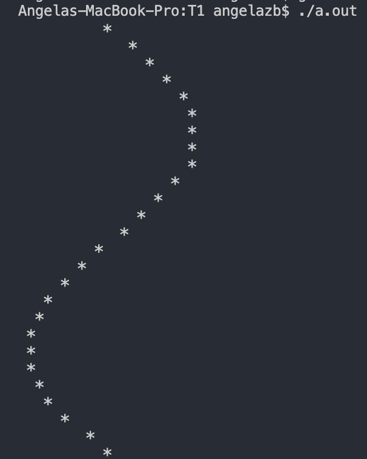

---


<p align="center"> <a href='https://www.youtube.com/playlist?list=PLlTc---1rMDX_e0lH5jX4VZy0nGFeYDbb'> Recorded videos (courtesy Willy) </a> </p>

---

# C Basics

---

You all should already have `gcc` working on your local machines, and be ready to attempt exercise 0 once it comes out. Today, we're going to go over C fundamentals, and then look at a few exercises. Here's a list of few things you should already know:


---

## Variables

---

- To declare a variable, you *need* to explicitly give it a type (which can never be changed). **Declaration** means you are simply telling the compiler that this variable exists. A variable *declaration* looks like this:
```c
// type   name
    double myDouble;
```
- Giving the variable a value is called *initialization*. Unlike Python, declaration and initialization are seprate in C. However, you can usually put them in one line. This looks as follows:

```c
double myDouble;     // Declaration
myDouble = 3.14;     // Initialization

int myInt = 1729;    // But can also do this...
```

- There are a few basic data types in C:
    1.  `int` - Integer
    2.  `long` - (Long) Integers, much bigger range of values
    3.  `char` - Characters; effectively an integer from -128 to 127
    4.  `float` - A floating point number (fractional)
    5.  `double` - A more precise floating point number (uses *double* the space)
    
    You will also eventually see variables defined as `unsigned int`, `unsigned char`, etc. When `unsigned` is used with one of the types that stores integers (`int`, `long` and `char`), it simply means that the variable only stores **postitive** values. (it has no sign). This is helpful to (1) avoid errors with negative numbers and (2) It lets us store more positive numbers in the same amount of space.

---

## Functions

---
 
Remember that a function *declaration* has the following parts (in order):
 - Return type of the function
 - Name of the function
 - Types of the input parameters (optionally names)

*However, when *defining* a function you must also give the parameters names.*

```c
int mySum(int, int);            // A valid declaration

int mySum(int a, int b) {
    return a + b;               // A function definition
}

int myProduct(int a, int b) {
    return a * b;               // Can do them together
}
```
Note that it may not always be a good idea to define and declare your function together. You will see issues arise with this as we move forward in the course.

---

## Conditionals

---

Nothing fancy here, you know what to expect. Make sure you have `()` around your conditions.
```c
if (condition) {

} else if (condition) {

} else {

}
```

---

## Loops

---

- For loops have 3 parts: initialization, condition and increment. Here is an example:
```c
// This is similar to `for i in range(n)`
for (int i = 0;    i < n;    i++) {  ... body ... }
//     init.      cond.     inc.
```

> `i++` is a shorthand for saying 'increment the value of `i` by 1, and return the **old** value'. Since here we do not actually care about the return value of the increment (`i++`), it serves the purpose of simply `i = i + 1`.

> Similarly, you can also do `++i`, which is shorthand for 'increment the value of `i`, and return the **new** value'.

- While loops have just the condition. The initialization and increment need to be done by you:
```c
int i = 0;
//     cond.
while (i < n) {  
    ... body ... 
    i++;
}
```

---

## Libraries

---

You won't always have all the functions available to you directly. Sometimes it is a good idea to use functions implemented by others which are part of a library instead of implementing them yourself. `stdio.h` is a library we use which is responsible for handling input / output for example. Here we will also use the `math.h` library. Import a library using:

```c
#include<library.h>
```
> Note that `#include` is what is called a 'compiler directive'. It basically takes all the content of the file `library.h` (which `gcc` knows where to find), and replaces the line with it.

---

# Exercise 

---

Write a program that prints out a graph of the function sin(x) for values of x from 0 to 2π in increments of 0.25. Here's some example output (courtesy Angela):



and here's some code you can fill in if you're having trouble doing it all yourself (it's okay! You're just getting started).
```c
#include <stdio.h>  
#include <math.h>   // Import math for sin()!

int main() {
  float pi = M_PI;   // This is defined for us in math.h
 
  // Main loop over the x values
  for (float x = ____; x < ______; x += _____) {
    // You will need another loop inside here...

    
  }
  return 0;
}

```

---

## Spicing it up a little

---

Now, modify your existing solution of the previous part and have a vertical line that represents the x-axis, in other words, have a line that corresponds to y=0.


---

# Key Takeaway(s)

---
- Every variable in C has an associated data type that cannot be changed. You should be familiar with the different data types C presents.

- Understand how to declare a function. Remember that, unlike Python, you need to begin the declaration with a return type.

- Conditionals are very similar to Python. Familiarize yourself with the standard comparison operators (i.e. `==`, `!=`, `<`, `>`) and logical operators (i.e. `||` (which is a logical OR) , `&&` (which is a logical AND)).

- Be familiar with defining a for loop and while loop. Understanding the difference between the two is also important.

- Similar to Python, C also has libraries in which you can use. You can use a library by typing `#include<library.h>`.

---

# Additional Exercises

---

These are not necessary, but give you an avenue to develop what you did in this tutorial into something a lot more impressive!

---

1. Add variables that let you change how long the sin wave is, how wide it is, and how much it is offset from the left side of the screen. Also give the user the option to draw the wave horizontally.

2. Based on whether the value is increasing / decreasing, print out `\`, `|`, `-`, `/` instead of just the asterisks (`*`). Make it look more curve-like. Details are left up to you.

3. Generalize the code so that it can plot out any (reasonable) function like sin. You might have to ask the user to enter bounds on the `x` and `y` axes between which you plot them.