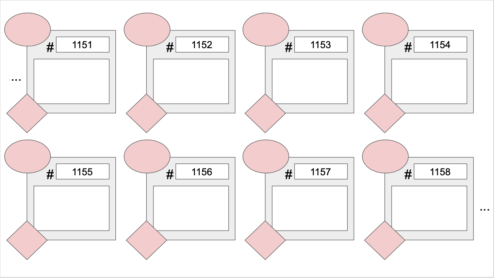

---

# C Memory Model and Debugging

---

## Memory Model in C

---

Last week we learnt about the memory model in C, for this week, we want to do another example to make sure we have it down :)

Remember that lockers are created in memory automatically for:
- Declared variables
- Input parameters to functions
- Storing return values of functions

> In the next unit, we will learn about explicitly asking for some lockers in C!

---


Let's try this example and draw the diagram of the memory model for the following piece of code, right at the point where the result is returned (right before releasing the spaced reserved for the funcion). Again, if you're working digitally, you can use this template to draw on:




```c
#include<stdio.h>

int sum_times(int i, int sum) {
    sum = sum + 10*i;
    return sum;      
}

int main() {
    int i, result;

    result = 0;
    
    for (i = 0; i <= 5; i++){
        result = 2 * sum_times(i, result);
    }

    # Draw the memory model at this point!

    printf("result %d", result);

    return 0;
}


```

---

## Debugging time!

---

We will follow the tutorial in the <a href='https://csca48f20.github.io/tutorials/debug'>Debugging</a> tab to learn how to GDB works and how we can use it to debug our C files. It will come in handy when you are having trouble finding where your code is failing.

---
