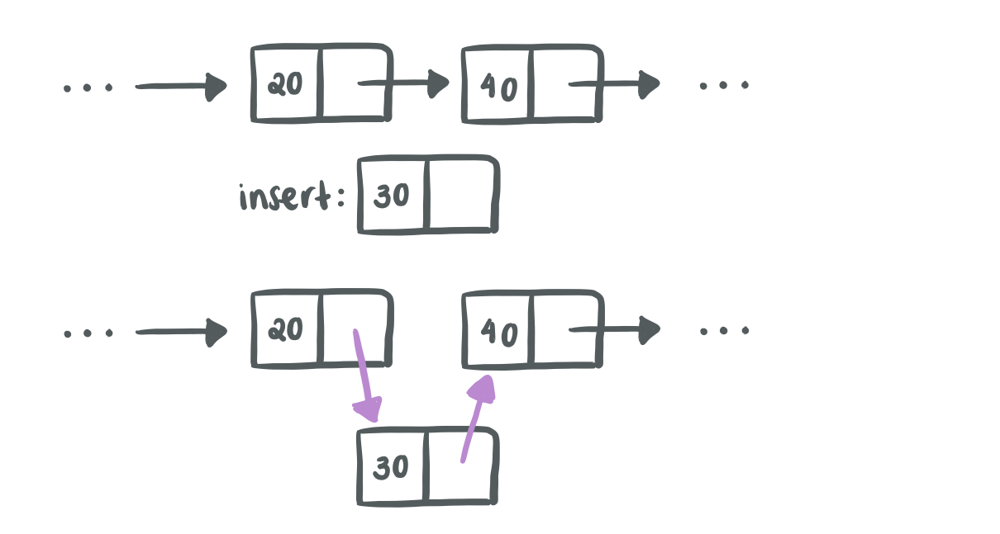
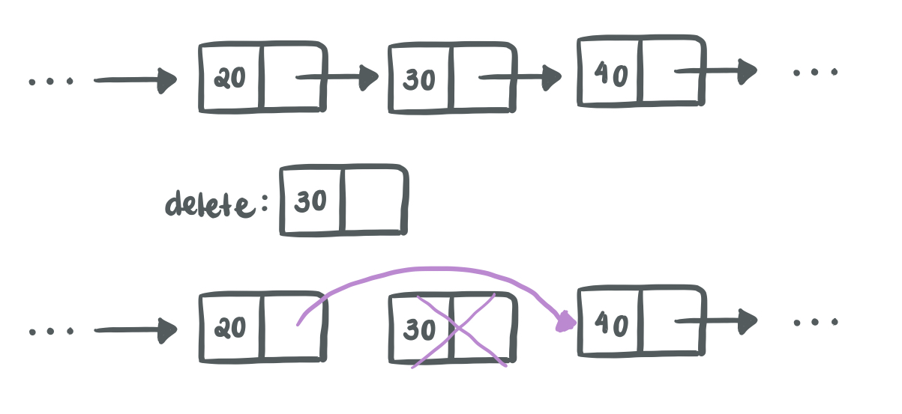
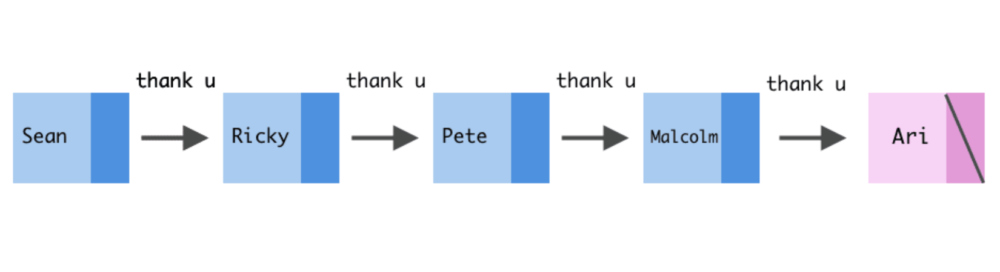

---


<p align="center"> <a href="https://youtu.be/94Y_a6DcrL8"> Recorded videos (Thanks Will!) </a> </p>

---

# Linked Lists

Linked Lists are one of the simplest implementations of the Lists ADT (Abstract Data Type). It is formed by a set of nodes, that are arranged in such a way that each node *points to* the next node. Each node will contain a value and a pointer to the next node.

The first node is called the **head** of the list and the last node is called the **tail** of the list. Remember that there is no node that will point to the head and the tail does not point to any node.

---

## How do we define a Linked List?

---

Let's define a generic node:

```c
typedef struct list_node {
   int val;                 // Data stored
   struct list_node *next   // Pointer to the next list of nodes
} node;
```

---

## How do we declare a Linked List?

---

Once we have defined our new node data type, we can start initializing some nodes!

```c
void main() {
    node node_one;
    node node_two;
    node node_three;
    
    node_one.val = 10;
    node_one.next = &node_two;
    
    node_two.val = 20;
    node_two.next = &node_three;
    
    // Can also access node three through the links
    (node_one.next)->next->val = 30;     // node_three.val = 30
    (node_one.next)->next->next = NULL;  // node_three.next = NULL
    
    return 0
} 
```

We can connect different nodes together by just updating the previous *next* pointer. But it's not as straight forward as it sounds:

If you want to **insert** a node at any point of the linked list, you need to *traverse* every node until you find the node in the list that will point to the new node you are insterting and update the pointers.



If you want to **delete** a node from the linked list, you need to *traverse* every node until you find the node you need to remove, and update its neighbours pointers.



---

### Angela's Favourite Linked List

---



*Credits: Ali Spittel,* <a href="https://dev.to/aspittel/thank-u-next-an-introduction-to-linked-lists-4pph"> dev.to </a>

---

# Dynamic Memory Management


Normally when you declare variables inside a function, they are local to the function. When the function exits, this memory is cleared. This is where dynamic memory comes in! Using built-in functions, you can ask for some memory that persists even when the function returns. 

For instance, this allows us to write other functions to help declare new nodes for our linked list, instead of having to allocate everything in `main()`. More importantly, it gives us the ability to be able to allocate as many nodes as needed even though we may not know how many are needed when writing the program (hence, dynamic).

---

## How do you use it?

---

You can use the `calloc()` function to ask for memory. It’s parameters simply determine the total amount of memory to allocate. (They are multiplied together to get the total number of bytes).

It returns a pointer to the block of memory which is the only way to access this block, so make sure you don’t overwrite it by mistake.

When you are done using the memory, you need to manually free it using the `free()` function. It takes in a pointer returned by a `calloc()` call.

This is how you would allocate enough space for **N elements** of **type T**:

```c
T *allocatedPtr = (T *) calloc(N, sizeof(T));
```

Once you are done, you will free it like this:

```c
free(allocatedPtr);
```
---